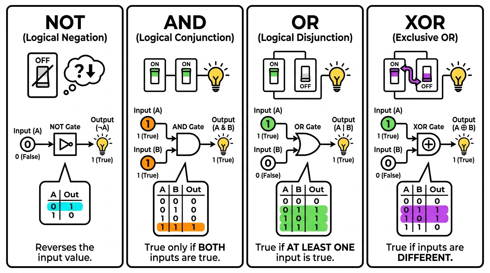

# Instructions & Electricity (Circuits)


## Learning Objectives

After this lesson you should be able to:
- Explain why computers use **binary** and how a **switch/transistor** physically represents a bit.
- Build the truth tables for **NOT, AND, OR, XOR** and combine gates into larger functions (**MUX**, **bit-equal**, adders).
- Trace how a **half adder** and **full adder** add bits, and how full adders chain into an N-bit adder.
- Distinguish **combinational logic** ("always on") from **clocked storage** (registers/memory).
- Explain the central idea that an **instruction is just bits that steer the circuits** (e.g., selecting the ALU's output).

## Where We Are in the Abstraction Stack

We've been working at the **C code** level. Today we drop near the bottom — **transistors → gates → circuits** — to see how the **CPU** physically computes.

Recall the model: **Computer = Memory + Processing.**
- So far: **Memory** — how variables are stored and accessed in C.
- Now: **CPU + Memory** — how *instructions* are represented and carried out in hardware.

## Why Binary?

Binary (two states) is easy to represent physically and reliably:
- True/False
- Mechanical: present/absent, holes, dots (Jacquard loom, IBM punch cards)
- Electronic: electrical charge (+/−), current flow, magnetic field

Two clearly distinguishable states are far more reliable than trying to read many voltage levels.

## Boolean Algebra

George Boole (1815–1864) created **math with True/False**. Three fundamental operations:
- **NOT**
- **AND**
- **OR**

The key insight: if we can build **switches** that perform Boolean logic, we can do computation **automatically** — machines that operate on binary.

## The Building Block: The Electronic Switch

A switch controls whether current flows. Across history, switches got faster, smaller, and more reliable:

| Technology | Era | Speed / notes |
|-----------|-----|---------------|
| **EM relay** | early | ~50 switches/sec; a control wire opens/closes a mechanical switch. Slow, wears out. *(A dead moth jammed in one gave us the word "bug.")* |
| **Vacuum tube** | 1940s–50s | 1000s of switches/sec; no moving parts but fragile and expensive. Used in **Colossus** (1942, first programmable electronic computer) and **ENIAC** (1946, general-purpose, ~5000 add/sub per second). |
| **Transistor** | 1957+ | A semiconductor switch controlled by electricity; ~10,000 switches/sec, solid, small, cheap. First all-transistor computer: **IBM 608** (3000 transistors). |
| **Modern transistors** | today | Smaller than 50 nm (paper is ~100,000 nm thick); millions of switches/sec; run for decades. Made of silicon → "Silicon Valley." |

**Big idea:** the *logic* never changed — only the switch technology underneath got better. That's abstraction in action.

## Logic Gates from Transistors

Transistors are wired into **gates** that implement Boolean operations.

### NOT
| Input | Output |
|-------|--------|
| True | False |
| False | True |

### AND (output True only if both inputs True)
| A | B | A AND B |
|---|---|---------|
| T | T | T |
| T | F | F |
| F | T | F |
| F | F | F |

### OR (output True if either input True)
| A | B | A OR B |
|---|---|--------|
| T | T | T |
| T | F | T |
| F | T | T |
| F | F | F |

Each gate is built from switches and current/ground paths, then **abstracted** into a single symbol (AND, OR, NOT) so we can design without thinking about transistors.

> **Key idea:** Any Boolean function can be built out of AND, OR, and NOT gates.

## Building Bigger Functions from Gates

### Bit Equal (BE) — "are two bits the same?"
```
a == b   ⟺   (a && b) || (!a && !b)
```
Built from two ANDs, two NOTs, and an OR.

### Bit Multiplexor (MUX) — "pick one of two inputs"
```
out = (s && a) || (!s && b)     // a if s is 1, b if s is 0
```
A MUX uses a **select bit** `s` to choose between inputs `a` and `b`. This is how hardware "chooses."

### Scaling up to words
- **Word-Level Equality (`A == B`)**: run a **Bit Equal** on each pair of bits, then **AND** all the results together (a 4-bit word uses 4 BEs).
- **Word-Level Mux**: one MUX per bit, all sharing the **same select bit `S`**, choosing the whole word `A` or `B`.

These combine into circuits that, e.g., output 1 if `A == B`, or select between `A` and `B` using `S`.

## Arithmetic from Gates

### XOR (True when inputs differ) — the heart of addition
| A | B | A XOR B |
|---|---|---------|
| T | T | F |
| T | F | T |
| F | T | T |
| F | F | F |

### 1-bit addition and the Half Adder
Adding two bits gives a **Sum** and a **Carry**:

| A | B | Sum | Carry |
|---|---|-----|-------|
| 0 | 0 | 0 | 0 |
| 0 | 1 | 1 | 0 |
| 1 | 0 | 1 | 0 |
| 1 | 1 | 0 | 1 |

- **Sum = A XOR B**, **Carry = A AND B**. This is a **half adder**.

### Full Adder (Ripple Adder)
A **full adder** also takes a **Carry In**, producing Sum and Carry Out — so carries can chain. Stacking N full adders (each carry feeding the next) builds an **N-bit adder**: feed `0` as the first carry-in, and the carry **ripples** up the bits.

### ALU (Arithmetic Logic Unit)
An **ALU** bundles several operations (add, AND, …) and uses a **MUX** controlled by an **operation code (OP)** to select **which** result comes out. The hardware computes *all* the options in parallel; the OP bits just pick the answer.

## Storage and the Clock

Gates/circuits are **combinational** — "always on": the output changes whenever the input changes. To *remember* a value we need **storage**:
- A storage element **stores its input on the rising clock edge**.
- **Memory / Registers** add: an **address as a selector**, **read/write signals**, and input/output wires. This separates the storage from the logic.

## A Simple Computer

Put it together: an **instruction** is just **bits that control everything**.
- Some instruction bits feed the ALU's **OP**, selecting what it outputs.
- Other bits select **which register** is the source, or **what source** sets a register.

## Common Pitfalls & Misconceptions

- **Thinking the ALU "decides" what to compute.** It doesn't choose — it computes **all** its operations every cycle, and a **MUX driven by the opcode bits** selects which result leaves the ALU. The "decision" is just wires selecting an output.
- **Confusing combinational logic with storage.** Gates have no memory: change the inputs and the output changes immediately. To *remember* a value you need a **clocked register**, which captures its input only on the clock edge.
- **Reading XOR as OR.** XOR is 1 only when inputs **differ** (`1 XOR 1 = 0`). OR is 1 when **either** is 1 (`1 OR 1 = 1`). XOR — not OR — produces the sum bit in addition.
- **Forgetting the carry.** A *half* adder cannot accept a carry-in, so it can't be chained. Multi-bit addition needs *full* adders so each column's carry feeds the next.
- **Believing the logic changed over history.** Relays → tubes → transistors changed only the **switch**; the Boolean logic built on top is identical. That's abstraction doing its job.

## Summary

- Levels of abstraction: **transistors → gates → circuits → ALU**.
- **Circuits are "always on"** — output tracks input continuously.
- **Memory/registers store values on the clock edge.**
- **Instructions are just bits that control everything**: the ALU always computes all possibilities, and instruction bits select the output, the registers, and the data sources.

## Self-Check

1. Why is binary preferred over a many-valued physical representation?
2. Write the Boolean expression for a 2-input MUX and explain how the select bit works.
3. For a half adder, which gate produces the Sum and which produces the Carry?
4. What is the difference between a combinational circuit and a register, and what role does the clock play?
5. In an ALU, what determines which operation's result appears at the output?