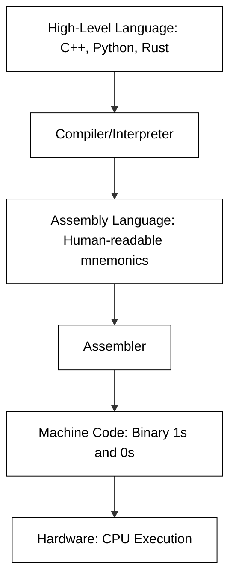

# Introduction to Assembly Language

To understand assembly language is to understand the soul of a computer. While most modern developers spend their careers in the comfortable abstraction of high-level languages like Python, Java, or C#, these languages eventually must be translated into something the physical hardware can execute. Assembly language sits at the boundary between software and hardware. It is the lowest-level programming language that is still readable by humans, providing a symbolic representation of the numeric machine codes that drive a Central Processing Unit (CPU).

In this unit, we begin our journey into the X86-64 architecture by exploring where assembly came from and why, despite the power of modern compilers, it remains a vital skill for computer scientists, security researchers, and systems engineers.

## The Evolution of the Instruction Set

In the earliest days of computing, such as the era of the ENIAC in the 1940s, "programming" was a physical task. Engineers had to manually flip switches and plug cables into patch panels to route data through the machine's circuits. There was no "code" in the sense we understand it today; the configuration of the hardware *was* the program.

As computers evolved to store programs in memory (the von Neumann architecture), programming shifted to writing sequences of numbers known as **machine code**. Each number corresponded to a specific operation, such as adding two values or moving data from one memory location to another. However, writing long strings of hexadecimal or binary digits was incredibly error-prone and nearly impossible to debug.

Assembly language was created in the late 1940s and early 1950s—credited largely to Kathleen Booth—to solve this problem. It replaced cryptic numeric codes with **mnemonics**. Instead of remembering that the hex value `0x01` might mean "add," a programmer could simply write `ADD`. This shift allowed for the creation of more complex software while maintaining a one-to-one relationship with the hardware instructions.



## Why Assembly Matters Today

It is a common misconception that assembly language is a "dead" skill. While you likely won't write a web application or a spreadsheet program in assembly, it remains indispensable in several specialized fields.

### Performance and Optimization
Modern compilers are incredibly sophisticated, but they are generalists. They are designed to produce "good enough" code for a wide variety of scenarios. In high-performance computing—such as video game engines, real-time signal processing, or cryptographic libraries—a developer might write a critical "hot path" in assembly to squeeze every ounce of performance out of the CPU, utilizing specific hardware features that a compiler might overlook.

### Direct Hardware Interaction
When writing an Operating System (OS) kernel or a device driver, you must interact directly with CPU registers, interrupt controllers, and memory management units. High-level languages often lack the syntax to perform these low-level operations. Assembly provides the "keys to the kingdom," allowing the programmer to control the hardware without any intervening layers of abstraction.

### Reverse Engineering and Security
If you are a cybersecurity professional analyzing a piece of malware, you rarely have access to the original source code. You are left with a compiled binary. To understand what the malware does, you must be able to read the disassembled code. Similarly, finding and exploiting vulnerabilities like buffer overflows requires a deep understanding of how the stack and registers behave at the assembly level.

### Understanding the "Black Box"
Learning assembly changes how you write high-level code. When you understand how a "for loop" is actually implemented with jump instructions and flags, or how a function call involves pushing and popping values from a stack, you become a better debugger. You stop seeing the computer as a magical box and start seeing it as a predictable mechanical system.

## Practical Example: From High-Level to Low-Level

To visualize the difference, consider a simple task: adding two numbers and storing them in a third variable.

**High-Level (C language):**
```c
int a = 5;
int b = 10;
int c = a + b;
```

**Low-Level (Conceptual X86-64 Assembly):**
```assembly
mov eax, 5          ; Load the value 5 into the EAX register
mov ebx, 10         ; Load the value 10 into the EBX register
add eax, ebx        ; Add the value in EBX to EAX (EAX now holds 15)
mov [result], eax   ; Move the value in EAX into a memory location labeled 'result'
```

In the high-level version, the "where" and "how" of the data storage are hidden. In the assembly version, we see the specific **registers** (small, fast storage areas inside the CPU) being used and the exact steps taken to perform the math.

## Common Challenges and Solutions

Transitioning to assembly language requires a shift in mindset. Here are some common hurdles students face:

*   **The "Verbosity" Trap:** Students often feel overwhelmed by how many lines of assembly it takes to do something simple. 
    *   *Solution:* Focus on small blocks of logic. Don't try to read 100 lines at once; identify the "set up," the "operation," and the "result."
*   **Managing State:** In Python, you can have hundreds of variables. In assembly, you have a limited number of registers.
    *   *Solution:* Learn to use the **Stack**. The stack is a region of memory used to temporarily store data when you run out of registers.
*   **Lack of Safety:** Assembly will let you do exactly what you tell it to do, even if that means crashing the system or overwriting vital memory.
    *   *Solution:* Use a debugger like GDB or an online simulator to step through your code one instruction at a time. This allows you to see the registers change in real-time.

## Thoughtful Engagement

Before moving on to the specific syntax of X86-64, take a moment to consider the software you use daily. If you were tasked with making a piece of software run twice as fast, would you look at the algorithm (the high-level logic) or the implementation (the low-level instructions)? Often, the answer is both. Assembly gives you the power to address the latter.

How much of your computer's power is currently "hidden" from you by the languages you use? As we progress through this unit, you will begin to see through those layers of abstraction.

## External Resources

For those interested in seeing how different compilers translate code into assembly in real-time, the following resources are highly recommended:
- [Compiler Explorer (godbolt.org)](https://godbolt.org/): An essential tool for comparing high-level code to its assembly output.
- [NASM (Netwide Assembler) Documentation](https://www.nasm.us/docs.php): The definitive guide for the assembler we will use in this course.

## Summary

Assembly language is the bridge between the logic of the programmer and the physics of the processor. Born from the need to make machine-level programming manageable, it has survived decades of technological advancement because it offers unparalleled control and insight. Whether for performance, security, or a deeper understanding of system architecture, mastering assembly is a transformative step for any computer scientist. In the next section, we will begin looking at the specific architecture of the X86-64 CPU and its register set.

```masteryls
{"id":"cf09be10-750f-4a7b-be46-9293fec6e80e","title":"Modern Utility of Assembly","type":"multiple-choice"}
Despite the prevalence of high-level programming languages like Python or C++, assembly language remains a vital tool in specific engineering domains. Which of the following scenarios best illustrates why a developer would choose to use assembly language in a modern context?

- [ ] To ensure that the software can run on any hardware architecture without needing to be recompiled or modified for different CPUs.
- [ ] To decrease the time required for initial prototyping and debugging by using a syntax that closely resembles natural human language.
- [x] To achieve maximum execution speed and minimal memory footprint in performance-critical components like bootloaders, kernel modules, or hardware drivers.
- [ ] To simplify the development of complex business logic through high-level abstractions and automated garbage collection.
```

```masteryls
{"id":"af317f30-f068-4698-a110-2346194cb0b6", "title":"pointers", "type":"essay"}
Give an example of assigning a pointer to the second element of an array
```

```masteryls
{"id":"d8f50e1b-56d7-4fcc-ba5b-21096b1fc28a", "title":"Likert survey", "type":"likert", "showResults":"editor" }
Please rate each statement.

Scale: Strongly disagree | Disagree | Neutral | Agree | Strongly agree

| qid | item |
|-----|------|
| prep | I came prepared for class. |
| engage | I stayed engaged during activities. |
| clarity | The lesson objectives were clear. |
```

```masteryls
{"id":"075736bc-7384-4cf8-a969-c13c0565e712", "title":"Teaching", "type":"teaching" }
Help me understand the **Socratic method**.
```
