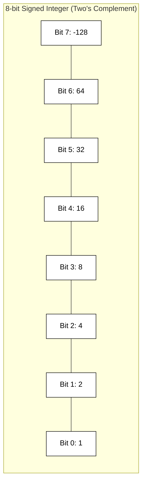

## Memory Representation: Integers and Characters

At the hardware level, computers do not understand "numbers" or "letters" in the way humans do. Everything is stored as **bits** (binary digits), which are grouped into **bytes** (8 bits). How these bits are interpreted—whether as a signed number, an unsigned number, or a character—depends entirely on the data type assigned to that memory location.

### Unsigned Integers
Unsigned integers are the simplest to represent. They use a straight binary (base-2) system where every bit represents a power of two. For an 8-bit unsigned integer (a `uint8`), the range is $0$ to $255$ ($2^8 - 1$).

*   **Example:** The decimal number `13` is represented in an 8-bit byte as `00001101`.
    *   $(1 \times 2^3) + (1 \times 2^2) + (0 \times 2^1) + (1 \times 2^0) = 8 + 4 + 0 + 1 = 13$.

### Signed Integers and Two's Complement
To represent negative numbers, most modern systems use **Two's Complement** notation. In this system, the most significant bit (the leftmost bit) acts as a sign bit but also carries a negative weight.

To find the Two's Complement representation of a negative number (e.g., -5):
1.  Start with the positive binary representation: `00000101` (5).
2.  Invert all bits (One's Complement): `11111010`.
3.  Add 1 to the result: `11111011` (-5).

The primary advantage of Two's Complement is that mathematical operations like addition and subtraction work identically for both positive and negative numbers without needing special hardware logic.



### Characters
Characters are represented in memory as integers using an encoding standard. The most common foundational standard is **ASCII** (American Standard Code for Information Interchange), which maps specific characters to values between 0 and 127. Modern applications typically use **UTF-8**, which is backwards compatible with ASCII but allows for multi-byte sequences to represent global symbols and emojis.

When you store the character `'A'` in memory, the computer stores the binary value for `65`.

| Character | Decimal | Binary (8-bit) | Hexadecimal |
|-----------|---------|----------------|-------------|
| 'A'       | 65      | `01000001`     | `0x41`      |
| 'B'       | 66      | `01000010`     | `0x42`      |
| 'a'       | 97      | `01100001`     | `0x61`      |
| '1'       | 49      | `00110001`     | `0x31`      |

### Code Example: Viewing Memory
The following C code demonstrates how the same bit pattern can be interpreted differently depending on the type.

```c
#include <stdio.h>

int main() {
    // The bit pattern for 65
    unsigned char myData = 65;

    // Interpret as an integer
    printf("As integer: %d\n", myData); // Output: 65

    // Interpret as a character
    printf("As character: %c\n", myData); // Output: A

    // A signed 8-bit integer where the top bit is 1
    signed char negativeVal = 0b11111111; 
    printf("Binary 11111111 as signed: %d\n", negativeVal); // Output: -1
    
    return 0;
}
```

```masteryls
{"id":"8ce37526-789e-4a69-91bf-848d92501b1a","title":"Two's Complement Understanding","type":"multiple-choice"}
In an 8-bit signed integer using Two's Complement, what is the decimal value of the binary sequence 11111110?

- [ ] -1
- [x] -2
- [ ] 254
- [ ] -126
```

