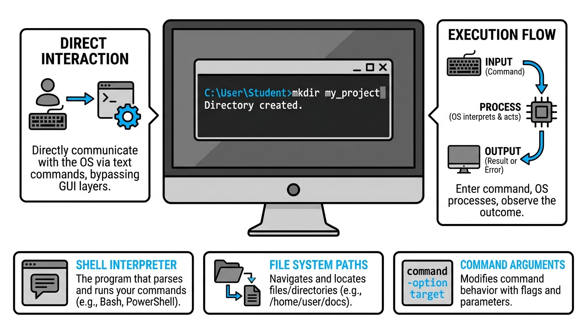

# Using the Command Line



## Navigating the Linux File System

The command line interface (CLI) is a powerful tool that allows you to interact with your computer's operating system by typing text commands. Unlike a Graphical User Interface (GUI) where you click on folders, the CLI requires you to "move" through a directory tree using specific commands. Understanding your current location and how to manipulate files is the foundation of becoming a proficient Linux user.

The three most fundamental commands for navigation are `pwd`, `ls`, and `cd`. 

*   **`pwd` (Print Working Directory):** This command tells you exactly where you are in the file system. It outputs the "absolute path" from the root directory to your current folder.
*   **`ls` (List):** This command displays the contents of your current directory. You can use flags like `-l` to see more detail (permissions, size, date) or `-a` to see hidden files.
*   **`cd` (Change Directory):** This is how you move between folders. You can move forward into a child folder or backward using the `..` shortcut.

```bash
# Check current location
pwd
# Output: /home/username/projects

# List files in the current folder
ls -l

# Move up one level in the directory tree
cd ..

# Move into a specific folder
cd documents/work
```

Once you know where you are, you often need to create new spaces for your data. The `mkdir` command (Make Directory) is used to create new folders. To create files, the `touch` command is a quick way to generate an empty file.

```bash
# Create a new directory named 'backup'
mkdir backup

# Create multiple directories at once
mkdir images videos scripts

# Create a new empty text file
touch notes.txt
```

The relationship between these commands and the file system can be visualized as a tree structure. When you use `cd`, you are essentially traversing the branches of this tree.

```mermaid
graph TD
    Root[/] --> Home[home]
    Home --> User[username]
    User --> Docs[Documents]
    User --> Projects[Projects]
    Projects --> WebApp[web-app]
    Projects --> Data[data]

    classDef default fill:#ffffff,stroke:#000000,color:#000000,stroke-width:1px;
```

Beyond basic navigation, you will frequently use commands to move, copy, or delete files. It is important to exercise caution with the `rm` (remove) command, as there is no "Trash" or "Recycle Bin" in the standard command line—once a file is deleted, it is usually gone forever.

*   **`cp <source> <destination>`**: Copies a file or directory.
*   **`mv <source> <destination>`**: Moves or renames a file or directory.
*   **`rm <file>`**: Deletes a file. Use `rm -r` to delete a directory and its contents.

```masteryls
{"id":"0043b619-7647-4cf7-b7e7-d93001f7dd80","title":"Identifying Your Location","type":"multiple-choice"}
You have been working in several nested folders and have lost track of your current location in the file system. Which command should you type to see the full path of your current directory?

- [ ] ls -a
- [ ] cd ~
- [x] pwd
- [ ] dir --show-path
```
