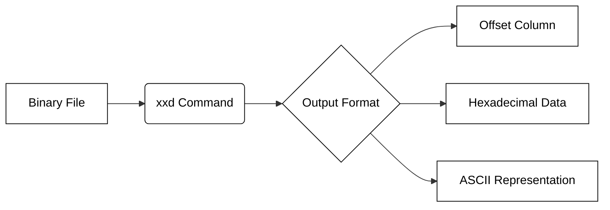

## Mastering Hex Dumps with xxd
In this unit you will write a program that is similar to the xxd linux command.  You ought to become familiar with this command so that you can make your job easier.

The `xxd` command is a powerful Linux utility used primarily to create a hex dump of a given file or standard input. It transforms binary data into a human-readable format that displays the offset, the hexadecimal representation of the bytes, and the corresponding ASCII characters. This is essential for debugging compiled binaries, inspecting network packets, or analyzing file structures where non-printable characters are present.

When you run `xxd` without any additional flags, it produces a standard three-column output. The first column represents the memory address (offset), the middle section shows the hex values (grouped by two bytes by default), and the final column shows the ASCII translation.

```bash
# Create a simple text file and view its hex dump
echo "Hello Linux" > test.txt
xxd test.txt
```

**Output Example:**
```text
00000000: 4865 6c6c 6f20 4c69 6e75 780a            Hello Linux.
```

### Common Formatting Options

You can customize the output of `xxd` to suit your analysis needs using various flags. The most frequently used options include:

*   **`-g [bytes]`**: Change the number of bytes grouped together. For example, `-g 1` shows every byte individually.
*   **`-c [cols]`**: Set the number of octets (bytes) displayed per line.
*   **`-l [len]`**: Stop after writing `len` octets. This is useful for inspecting just the headers of large files.
*   **`-p`**: Output in "plain" hex format (continuous hex without addresses or ASCII). This is often used for passing data to other scripts.

The following diagram illustrates how `xxd` processes a file into its formatted components:



### Reverting Hex Dumps

One of the most powerful features of `xxd` is its ability to perform the reverse operation. Using the `-r` (revert) flag, you can convert a hex dump back into its original binary format. This is a common technique for "patching" binaries: you can export a file to hex, edit a few bytes in a text editor, and then use `xxd -r` to reassemble the binary.

```bash
# Convert a plain hex string back into a binary file
echo "48656c6c6f" | xxd -r -p > output.bin

# Verify the content
cat output.bin
# Output: Hello
```

```masteryls
{"id":"xxd_revert_flag", "title":"Identifying the Revert Flag", "type":"multiple-choice"}
You have a text file containing a hexadecimal representation of a program. Which command flag would you use with xxd to convert that hex text back into a functional binary file?

- [ ] -v
- [ ] -h
- [x] -r
- [ ] -p
``