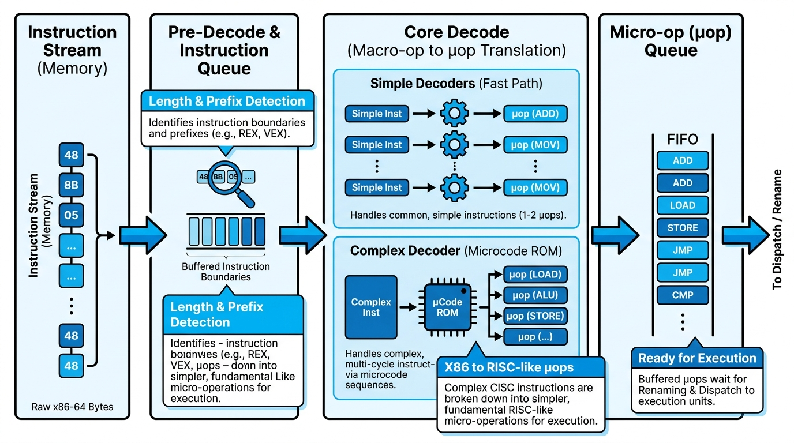

# Y86-64 Encodings & Sequential Architecture (SEQ)

## Learning Objectives

After this lesson you should be able to:
- Explain that an instruction is **a sequence of bytes** containing an instruction code/function and optional register specifiers and an 8-byte constant.
- Name the **six SEQ stages** in order and state what each does.
- Trace a single instruction through the stages, identifying the **signals** each stage reads and writes (the basis of Project 3).
- Explain **why** staged execution enables **pipelining**, and what hazards pipelining introduces.

## Recap & Today's Questions

You've written Y86-64 assembly and watched it change processor state. Two new questions:
1. **How are instructions encoded** and stored in memory (as bytes)?
2. **How does the hardware actually execute** them?

This material underlies **Project 3 — implementing parts of a Y86-64 simulator.**

## Instruction Encodings

Every instruction is a sequence of **bytes** in memory. Recall those bytes are really **signals on wires** that drive the hardware. An encoding includes:
- An **instruction code** + **instruction function** (which operation, and which variant — e.g., which jump/move condition).
- Optionally **register specifiers** (which registers, by their 0–F ids).
- Optionally an **8-byte constant** (an immediate or displacement).

This is why register ids matter and why immediates take extra bytes. (Use the posted Y86-64 reference sheet for the exact byte layouts.)

## Sequential Architecture (SEQ): Execution in Stages

The hardware executes each instruction by passing it through a fixed sequence of **stages**. Each stage does part of the work.

| # | Stage | What it does |
|---|-------|--------------|
| 1 | **Fetch** | Read the instruction bytes from memory (the **PC** is the address). Extract the instruction code and function; possibly read register specifiers and an 8-byte constant. |
| 2 | **Decode** | Read the operand value(s) from the **register file**. |
| 3 | **Execute** | The **ALU** performs the operation (add/and/…) **or** computes a memory address. Possibly **set** condition codes, **evaluate** condition codes, and decide **whether to jump**. |
| 4 | **Memory** | Possibly **write** data to memory or **read** data from memory. |
| 5 | **Write Back** | Possibly write up to **two** results back to the register file. |
| 6 | **PC Update** | Set the **PC** to the address of the next instruction. |

Then **repeat** from Fetch — until a `halt` or an error.

## How This Maps to Project 3

The project gives you **computation tables** that act like **pseudocode** for the hardware. For each instruction, they specify, **per stage**:
- what **signals it outputs**,
- what **signals it uses as input**,
- and **how the output depends on the input**.

Your job is to implement each stage function so the simulator reproduces correct behavior. Notes from the deck:
- All signals are defined in the **`stepMachine`** function, which calls the **stage functions you implement** (Fetch, Decode, Execute, Memory, PC Update, plus Write Back inputs).
- Example primitive: *"Get 1 byte of memory at address PC"* is the kind of operation Fetch is built from.

### Aside: pass by value vs. pass by reference (you'll need this in C)
- **Pass by value:** the function gets a **copy** of the argument; changes inside the function **don't** affect the caller's variable.
- **Pass by reference:** the function gets a **pointer** to the argument; it **can** change the caller's value. (This is how a stage function "outputs" a signal — by writing through a pointer the caller provided.)

## Why Stages? Pipelining

Splitting execution into stages enables **pipelining**:
- Put **registers between stages** to hold intermediate values (`valA`, `valB`, `valP`, …).
- Now **multiple instructions** can be in the pipeline at once (one per stage), so the processor finishes instructions **faster**.

**Challenges pipelining introduces:**
- **Branch prediction** — the next instruction sometimes depends on a previous one's result.
- **Discarding** irrelevant effects when a guess was wrong.
- Instructions take **different amounts of time** (memory access is slow), so stages must be balanced.

## Common Pitfalls & Misconceptions

- **Skipping a stage because "this instruction doesn't use it."** Every instruction passes through **all six** stages; a stage simply does nothing (or passes values through) when not needed. This uniformity is what makes the hardware regular — and what your Project 3 stage functions must preserve.
- **Confusing "Execute" with "do the whole instruction."** Execute is just the ALU/condition step. Reading registers happens in **Decode**, touching memory in **Memory**, and writing registers back in **Write Back**.
- **Forgetting PC Update.** The PC isn't advanced "automatically" in this model — the **PC Update** stage explicitly computes the next address (sequential, a jump target, or a return address).
- **Pass-by-value where pass-by-reference is needed (Project 3).** A stage "outputs" a signal by **writing through a pointer** the caller supplied. If you take the argument by value, the caller never sees your result.
- **Assuming SEQ is pipelined.** SEQ runs **one instruction at a time**. Pipelining is the *next* design that overlaps instructions by adding registers between stages.

## Summary

- All operations are ultimately **gates/circuits/transistors** wired together.
- **Instructions are just bytes = values on wires**; they flow through the circuitry and change program state.
- Execution proceeds in six SEQ stages: **Fetch → Decode → Execute → Memory → Write Back → PC Update**, repeated until halt/error.
- Staged execution makes **pipelining** possible (faster, but with new hazards).
- You'll **simulate all of this in Project 3** — *textbook §4.3 will be your friend.*

## Self-Check

1. Name the six SEQ stages in order and give one thing each does.
2. Which stage reads operands from the register file? Which one updates the PC?
3. What three things might an instruction's bytes contain beyond the instruction code/function?
4. Why does pipelining require registers *between* the stages?
5. Why does pass-by-reference matter for a stage function that must "output" a signal?